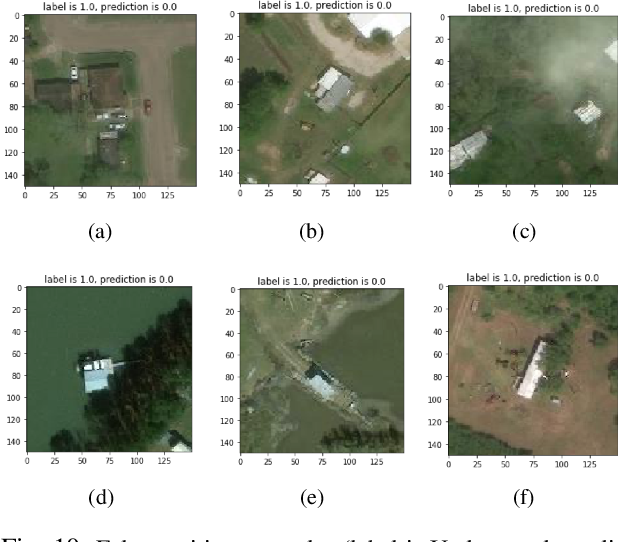

# Deep-Learning

This project is part of a deep learning module.

The first objective was to learn more about the notions seen during class, in particular convolution neural networks, and to apprehend them in the context of a concrete case, by completing our knowledge, in particular concerning transfer learning. 

The second objective was to perfect our skills in Python by using pytorch, torchvision and sklearn. First of all, we had to "translate" some code from keras to pytorch. This was done in the case of image processing in the context of natural risk management. It was based on an article of Quoc Dung Cao, Youngjun Choe entitled "Building Damage Annotation on Post-Hurricane Satellite Imagery Based on Convolutional Neural Networks". Then we had to implement new models using transfert learning with features extraction and/or fine-tuning.
